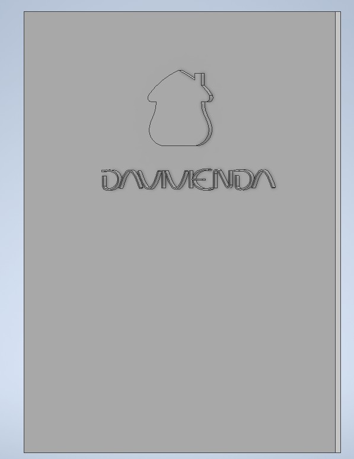
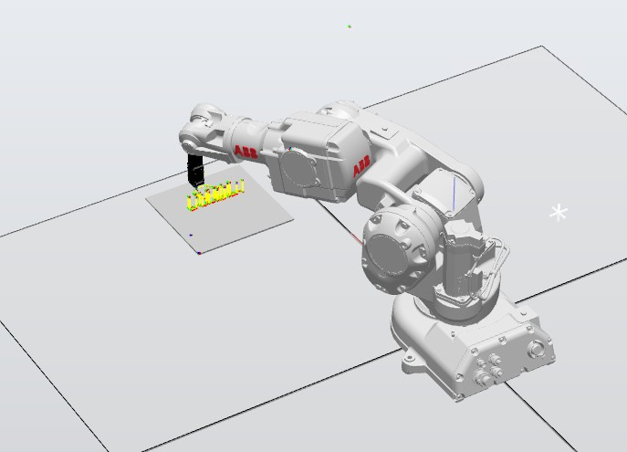

# Laboratorio 1 - Robótica industrial: Trayectorias / Entradas y salidas digitales

## Autores

Johan Lopez - [@ElJoho](https://github.com/ElJoho)

Christian Cuestas - [@ChrisCuestas](https://github.com/ChrisCuestas)

## __1. Contexto__

Se propone dibujar con el manipulador industrial de *ABB IRB 140* el nombre de la marca __*Davivienda*__, reconocida por sus destacadas campañas de marketing, junto con su respectivo logotipo de la casita roja.

## __2. Diseños necesarios__

### __2.1 Diseño de herramienta:__

Se requirió el diseño de una herramienta para acoplar al manipulador. Esta herramienta fue pensada para ser impresa en 3D y capaz de sostener un marcador borrable.

A continuación se presentan algunas imágenes del modelo 3D de la herramienta:

La herramienta tiene una inclinación de 30° respecto al eje Z del marco asociado al plato de montaje.

Para mayor detalle, en la carpeta [*Herramienta*](./Herramienta) se encuentran los archivos de inventor con los que se diseñó y ensambló el modelo digital de la herramienta, los archivos STL para su respectiva impresión aí como también  los archivos SAT para exportar el modelo a RobotStudio.

### __2.2 Diseño de tablero físico:__

__*AÑADIR INFO*__

### __2.3 Diseño de logo de *Davivienda*:__

Para facilitar el proceso de creación de paths, se diseñó un modelo digital en Inventor del logotipo y el nombre de la marca. Se hizo  el logotipo y las letras en relieve, como se muestra a continuación:

Para mayor detalle, en la carpeta [*Logo*](./Logo) se encuentran los archivos de inventor con los que se diseñó el logotipo y el archivo SAT para exportar el modelo a RobotStudio.

### __2.4 Diseño de estación en RobotStudio:__

Teniendo los modelos de la herramienta y el logotipo, se creó una estación en RobotStudio, importando un robot IRB 140 de la librería y los dos archivos SAT para la herramienta y el logotipo.

La configuración de la estación se muestra en la siguiente imagen:

Para mayor detalle, en la carpeta [*RobotStudio*](./RobotStudio) se encuentran los archivos de la estación.

## __3. Calibración__

### __3.1 Calibración de la herramienta:__

### __3.2 Calibración de _workobject_:__

## __4. Lógica de programación__

### __4.1 Funciones utilizadas:__

### __4.2 Diagrama de flujo:__

### __4.3 Programa en RAPID:__

## __5. Videos de implementación__

### __5.1 Simulaciones en RobotStudio:__

### __5.2 Implementación en robot real:__

