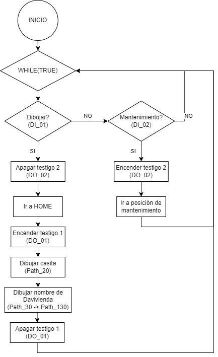

# Laboratorio 1 - Robótica industrial: Trayectorias / Entradas y salidas digitales

## Autores

Johan López - [@ElJoho](https://github.com/ElJoho)

Christian Cuestas - [@ChrisCuestas](https://github.com/ChrisCuestas)

## __1. Contexto__

Se propone dibujar con el manipulador industrial de *ABB IRB 140* el nombre de la marca __*Davivienda*__, reconocida por sus destacadas campañas de marketing, junto con su respectivo logotipo de la casita roja.

## __2. Diseños necesarios__

### __2.1 Diseño de herramienta:__

Se requirió el diseño de una herramienta para acoplar al manipulador. Esta herramienta fue pensada para ser impresa en 3D y capaz de sostener un marcador borrable.

A continuación se presentan algunas imágenes del modelo 3D de la herramienta:


La herramienta tiene una inclinación de 30° respecto al eje Z del marco asociado al plato de montaje.

El peso final de la herramienta fue de alrededor de 155g. Cuyo dentro de masa está descrito por [19.89 -0.01 58.09] a partir del marco asociado al plato de montaje.

Para mayor detalle, en la carpeta [*Herramienta*](./Herramienta) se encuentran los archivos de inventor con los que se diseñó y ensambló el modelo digital de la herramienta, los archivos STL para su respectiva impresión aí como también  los archivos SAT para exportar el modelo a RobotStudio.

### __2.2 Diseño de tablero físico:__

__*AÑADIR INFO*__

### __2.3 Diseño de logo de *Davivienda*:__

Para facilitar el proceso de creación de paths, se diseñó un modelo digital en Inventor del logotipo y el nombre de la marca. Se hizo  el logotipo y las letras en relieve, como se muestra a continuación:


Para mayor detalle, en la carpeta [*Logo*](./Logo) se encuentran los archivos de inventor con los que se diseñó el logotipo y el archivo SAT para exportar el modelo a RobotStudio.

### __2.4 Diseño de estación en RobotStudio:__

Teniendo los modelos de la herramienta y el logotipo, se creó una estación en RobotStudio, importando un robot IRB 140 de la librería y los dos archivos SAT para la herramienta y el logotipo.

La configuración de la estación se muestra en la siguiente imagen:


Para mayor detalle, en la carpeta [*RobotStudio*](./RobotStudio) se encuentran los archivos de la estación.

## __3. Calibración__

### __3.1 Calibración de la herramienta:__

Los datos relevantes del _tooldata_ para la estación en RobotStudio fueron los siguientes:

| **Propiedad**                                 | **Valor**                   |
|-----------------------------------------------|-----------------------------|
| Posición del TCP (en mm)                      | [72.50, 0.00, 155.57]       |
| Orientación del marco en el TCP (en RPY)      | [0°, 30°, 0°]               |
| Orientación del marco en el TCP ( cuaternios) | [0.96593, -0.00001, 0.25882, 0.00000]|
|-----------------------------------------------|-----------------------------|
| Masa (en kg)                                  | 0.155                       |
| Centro de gravedad (en mm)                    | [19.89 -0.01 58.09]         |

Para la calibración de la herramienta con el robot real se usó el método de 3 puntos y elongación a lo largo de Z con lo que obtuvimos los siguientes datos para el _tooldata_:

| **Propiedad**                                | **Valor**                   |
|----------------------------------------------|-----------------------------|
| Posición del TCP (en mm)                     | [59.2323, 42.9937, 166.388] |
| Orientación del marco en el TCP (cuaternios) | [0.720085, -0.231965, 0.62465, 0.200518]|

Al momento de comprobar si la calibración fue correcta mediente _jogging_ en modo reorientación, pudimos observar que la posición del TCP fue bastante precisa (según datos mostrados por el controlador, la precisión fue de +/-3mm aprox.)

También pudimos observar dos cosas sobre la orientación del marco en el TCP:

- El plato de montaje de los robots del laboratorio está ensamblado con una rotación de ~45° respecto a lo que se muestra en el manual del robot y lo que se observa en el modelo de la libreria de RobotStudio
- La inclinación de la herramienta a la hora de aproximarse al tablero para ejecutar los movimientos de dibujo no era la deseada. 

Por tal razón, decidimos definir el _tooldata_ con el que vamos a trabajar de la siguiente manera. La posición del TCP será la que nos arrojó la calibración con el robot y herramienta real, pero la orientación se definió con los datos obtenidos en Robot Studio. Así:

| **Propiedad**                                 | **Valor**                   |
|-----------------------------------------------|-----------------------------|
| Posición del TCP (en mm)                      | [59.2323, 42.9937, 166.388]      |
| Orientación del marco en el TCP (en RPY)      | [0°, 30°, 0°]               |
| Orientación del marco en el TCP ( cuaternios) | [0.96593, -0.00001, 0.25882, 0.00000]|

Con esto, sabremos que aunque la orientación del marco en el TCP es igual tanto en la simulación como en la realidad, pero que la forma como queda orientada la herramienta difiere entre simulación y la realidad. Pero dicha diferencia no afectaría en la escritura sobre el tablero, así que decidimos simplemente aceptar esta discrepancia y proseguir.

Para una mejor calibración de la herramienta con el robot real podría haberse usado el método de 3 puntos y elongación a lo largo de Z y de X. Pero debido a la limitación en tiempo que había, no nos propusimos volver a definir el _tooldata_.

### __3.2 Calibración de _workobject_:__

Los datos relevantes y finales del _workobject_ para la estación en RobotStudio fueron los siguientes:

- Para escribir sobre un plano horizontal:

| **Propiedad**                                 | **Valor**                   |
|-----------------------------------------------|-----------------------------|
| Posición del User Frame (en mm)               | [600, 450, 105]             |
| Orientación del marco del User Frame (en RPY)     | [0°, 0°, -90°]              |
| Orientación del marco del User Frame (cuaternios) | [0.368301, 0.18301, -0.18301, -0.68301]|
|---------------------------------------------------|---------------|
| Posición del User Frame (en mm)                   | [-20, -80, 0] |
| Orientación del marco del User Frame (en RPY)     | [0°, 0°, 0°]  |
| Orientación del marco del User Frame (cuaternios) | [1, 0, 0, 0]  |

- Para escribir sobre un plano inclinado 30° respecto a la horizontal:

| **Propiedad**                                 | **Valor**                   |
|-----------------------------------------------|-----------------------------|
| Posición del User Frame (en mm)               | [600, 450, 105]             |
| Orientación del marco del User Frame (en RPY)     | [30°, 0°, -90°]              |
| Orientación del marco del User Frame (cuaternios) | [0.368301, 0.18301, -0.18301, -0.68301]|
|---------------------------------------------------|---------------|
| Posición del Object Frame (en mm)                   | [-20, -80, 0] |
| Orientación del marco del User Object (en RPY)     | [0°, 0°, 0°]  |
| Orientación del marco del User Object (cuaternios) | [1, 0, 0, 0]  |

Para la calibración del User Frame del _workobject_ con el robot real se usó el método de 3 puntos cada vez que instalaba el tablero. Utilizamos los mismos datos del Object Frame para garantizar que el dibujo quede dentro del tablero real, y así corregir las dicrepancias con las dimensiones del modelo CAD del logo en relieve.

## __4. Lógica de programación__

### __4.1 Diagrama de flujo:__



### __4.2 Programa en RAPID:__

```rapid
! Proceso main() en RAPID
PROC main()
        WHILE (TRUE) DO             ! Mantiene la rutina en bucle, siempre pendiente
                                    ! de las entradas digitales
            IF TestDI(DI_01) THEN   ! Si el botón 1 se oprime entonces dibuje el logotipo
                SetDO DO_02,0;      ! Apaga testigo 2 (indicador de estado de 
                                    ! mantenimiento)
                Path_10;            ! Va a posición de HOME definida por usuario
                SetDO DO_01,1;      ! Enciende testigo 1 (indicador de estado de dibujo)
                Path_20;            ! Se acerca un punto de aproximación y
                                    ! dibuja la casita roja de Davivienda
                Path_30;            ! Dibuja letra D de Davivienda
                Path_40;            ! Dibuja letra A de Davivienda
                Path_50;            ! Dibuja letra V de Davivienda
                Path_60;            ! Dibuja letra I de Davivienda
                Path_70;            ! Dibuja letra V de Davivienda
                Path_80;            ! Dibuja letra I de Davivienda
                Path_90;            ! Dibuja letra E de Davivienda
                Path_100;           ! Dibuja letra N de Davivienda
                Path_110;           ! Dibuja letra D de Davivienda
                Path_120;           ! Dibuja letra A de Davivienda
                Path_130;           ! Se devuelve a al punto de aproximación
                SetDO DO_01,0;      ! Apaga testigo 1 (indicador de estado de dibujo)
                Path_10;            ! Regresa a posición de HOME definida por usuario
            ELSEIF TestDI(DI_02) THEN   ! Si el botón 2 se oprime entonces va a una 
                                        ! posición de mantenimiento
                SetDO DO_02,1;      ! Enciende testigo 2 (indicador de estado de 
                                    ! mantenimiento)
                Path_140;           ! Va a posición de mantenimiento
            ENDIF
        ENDWHILE
    ENDPROC
```

Para ver el programa completo, en la carpeta [*RobotStudio/RAPID*](./RobotStudio/RAPID) se encuentran los archivos de RAPID y el 'Module1' completo en un archivo _.txt_.

## __5. Videos de implementación__

### __5.1 Simulaciones en RobotStudio:__

- Video: 

### __5.2 Implementación en robot real:__

- Video:

