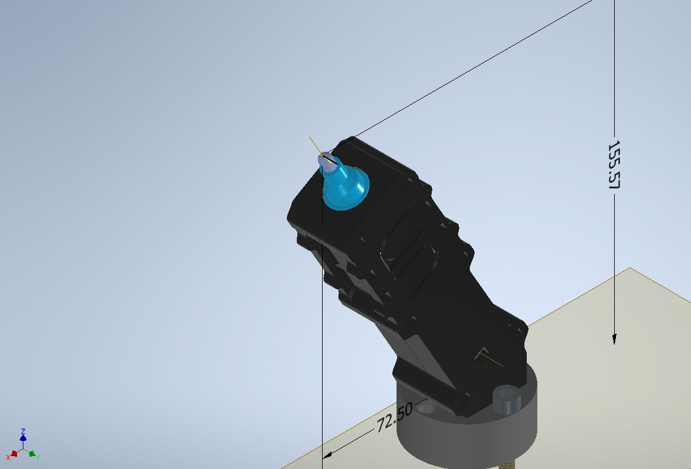

# Laboratorio 1 - Robótica industrial: Trayectorias / Entradas y salidas digitales

## Autores

Johan Lopez - [@ElJoho](https://github.com/ElJoho)

Christian Cuestas - [@ChrisCuestas](https://github.com/ChrisCuestas)

## Contexto:

Se propone dibujar con el manipulador industrial de *ABB IRB 140* el nombre de la marca __*Davivienda*__, reconocida por sus destacadas campañas de marketing, junto con su respectivo logotipo de la casita roja.

## Diseño de herramienta

Se requirió el diseño de una herramienta para acoplar al manipulador. Esta herramienta fue pensada para ser impresa en 3D y capaz de sostener un marcador borrable.

A continuación se presentan algunas imágenes del modelo 3D de la herramienta:

La herramienta tiene una inclinación de 30° respecto al eje Z del marco asociado al plato de montaje.

Para mayor detalle, en la carpeta [*Herramienta*](./Herramienta) se encuentran los archivos de inventor con los que se diseñó y ensambló el modelo 3D de la herramienta, los archivos STL para su respectiva impresión aí como también  los archivos SAT para exportar el modelo a RobotStudio.